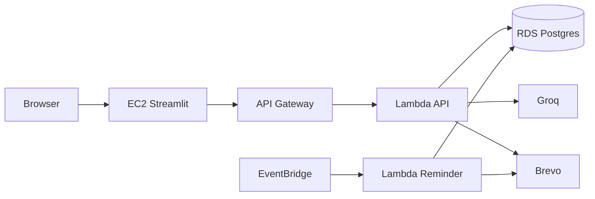

# Architecture Plan: AWS Free Tier Deployment (Fully Cloud)

Companion to [`architecture.md`](architecture.md). Run the **entire** app on AWS Free Tier: UI, API, database, reminders. No laptop in the runtime path.

## 1. Locked Choices

| Piece | Where | Why |
|---|---|---|
| UI | EC2 `t3.micro` + Streamlit | Long-lived process; not Lambda-friendly |
| API + agent | Lambda + Mangum + API Gateway HTTP API | Scales to zero; Always Free |
| DB | RDS Postgres `db.t3.micro` | Keep existing SQLAlchemy + exclusion constraints |
| Reminders | EventBridge every 5 min → reminder Lambda | Replaces APScheduler |
| LLM / email | Groq + Brevo (external) | Stay free; skip Bedrock/SES |
| Config | Env vars on Lambda + EC2 | No Secrets Manager / SSM |

Skip: CloudWatch dashboards/alarms/custom log groups, NAT, ALB, RDS Proxy, ECS, Amplify.

## 2. Architecture



**Chat / booking:** Browser → Streamlit on EC2 → API Gateway → API Lambda → RDS (+ Groq/Brevo).

**Vacate reminder:** EventBridge → reminder Lambda → RDS + Brevo (same claim/`reminder_sent_at` logic as today).

## 3. Components

| Today | Cloud |
|---|---|
| Streamlit | One EC2 `t3.micro`, `streamlit run` via systemd, port `8501` open |
| FastAPI + LangGraph | API Lambda (Mangum); no APScheduler in lifespan when `RUNNING_IN_LAMBDA=true` |
| APScheduler | Reminder Lambda on `rate(5 minutes)` |
| Docker Postgres | RDS `db.t3.micro`, public, single-AZ, `sslmode=require` |
| `.env` | Lambda env + EC2 systemd `Environment=` |

## 4. Free Tier Notes

- **EC2** and **RDS** each get ~750 hrs/month for 12 months → one always-on micro of each is fine.
- Delete both before month 13 or they bill.
- Do **not** create: NAT Gateway, ALB, RDS Proxy, second EC2, CloudWatch alarms/dashboards.
- One region for everything.

**Networking (simple demo):** Lambdas outside VPC; RDS and EC2 publicly reachable; strong DB password; RDS SG allows `5432`; EC2 SG allows `8501` (and `22` from your IP only).

## 5. Lambda (minimal)

- **API:** `app.lambda_handlers.api_handler` (Mangum); memory 512–1024 MB; timeout 30–60 s; CORS = EC2 Streamlit origin.
- **Reminder:** `app.lambda_handlers.reminder_handler` → existing vacate-reminder runner; memory 512 MB; timeout 30 s.
- Package as one container image or zip (LangChain stack is large).
- Short-lived DB connections via SQLAlchemy `NullPool` when `RUNNING_IN_LAMBDA=true`; no RDS Proxy.

Env vars: `DATABASE_URL`, `GROQ_API_KEY`, `BREVO_*`, `ODC_TIMEZONE`, `REMINDER_LEAD_MINUTES`, `RUNNING_IN_LAMBDA=true`.

On EC2 only: `API_BASE_URL=https://{api-id}.execute-api.{region}.amazonaws.com`.

### Local vs Lambda smoke

| Mode | How to run |
|---|---|
| Local API | `uvicorn app.main:app` — APScheduler on; `RUNNING_IN_LAMBDA` unset/false |
| Local handler unit tests | `cd backend && pytest -q tests/test_lambda_handlers.py` |
| AWS API Lambda | Handler `app.lambda_handlers.api_handler`, `RUNNING_IN_LAMBDA=true` |
| AWS reminder Lambda | Handler `app.lambda_handlers.reminder_handler`, EventBridge `rate(5 minutes)` |

## 6. RDS Setup

Apply migrations once:

```bash
psql "$DATABASE_URL" -f backend/migrations/001_add_vacate_reminder_claim.sql
psql "$DATABASE_URL" -f backend/migrations/002_add_waitlist_room.sql
psql "$DATABASE_URL" -f backend/migrations/003_add_booking_overlap_exclusion.sql
```

Seed the ODC room. No Docker DB in cloud.

## 7. Resources to Create

| Resource | Role |
|---|---|
| EC2 `t3.micro` + SG | Streamlit |
| API Gateway HTTP API | Public API URL |
| Lambda (API) | FastAPI + agent |
| Lambda (reminder) + EventBridge rule | Vacate job |
| RDS `db.t3.micro` + SG | Postgres |

## 8. Phases

1. Handlers: Mangum + reminder entrypoint; gate APScheduler.
2. Provision via CloudFormation: see [`infra/README.md`](infra/README.md) and [`infra/cloudformation/odc-stack.yaml`](infra/cloudformation/odc-stack.yaml) (EC2, API Gateway, Lambdas, EventBridge, RDS, ECR).
3. Migrate RDS; set env vars; hit `/health`.
4. Open Streamlit on EC2; book / cancel / extend from a browser.
5. Tear down EC2 + RDS when the case study ends (`aws cloudformation delete-stack --stack-name odc-meeting`).

## 9. Out of Scope

CloudWatch (alarms, dashboards, custom log setup), SSM, Secrets Manager, DynamoDB rewrite, SES, nginx/TLS, Elastic IP, Cognito, multi-AZ, NAT, ALB.
